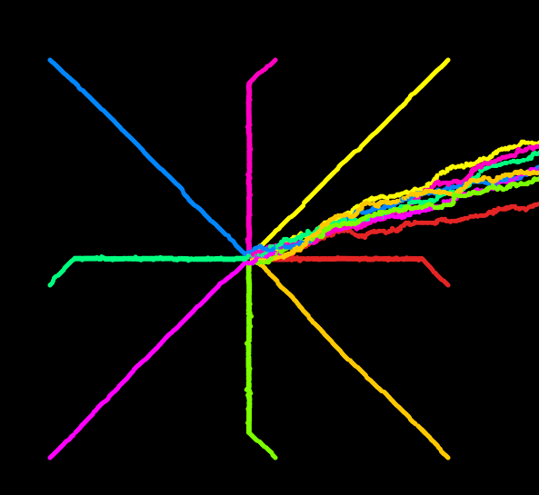

- Diferencia entre distribuciones uniformes y no uniformes.
  * Las distribuciones uniformes hacen que las probabilidades sean constantes, mientras que con las distribuciones no uniformes, las probabilidades son variables y tiendan hacia algunos valores más que hacia otros.

| Distribuciones uniformes | Distribuciones no uniforme|
|----------|----------|
| Todos los valores dentro de un rango tienen la misma probabilidad de ser generados.   |Los valores se generan con diferentes probabilidades, siguiendo una función de distribución específica.  |
| **Ejemplo:** Usar random(0, 1) en p5.js genera valores donde cada número entre 0 y 1 tiene igual probabilidad.| **Ejemplo:** randomGaussian() en p5.js genera valores según una distribución normal (gaussiana), donde los números cercanos al promedio son más probables que los números extremos.   |

**Código modificado**

Enlace de la simulación [aquí](https://editor.p5js.org/WatermelonSuggar/sketches/7_2peQFhK)

Después de converger en el centro tienden hacia la derecha.



```js
let walker1, walker2, walker3, walker4, walker5, walker6, walker7, walker8;

function setup() {
  createCanvas(640, 640);
  walker1 = new Walker(100, 100, color(0, 134, 255));
  walker2 = new Walker(540, 540, color(255, 201, 0));
  walker3 = new Walker(540, 100, color(255, 251, 0)); 
  walker4 = new Walker(100, 540, color(255, 0, 255));
  walker5 = new Walker(100, 350, color(0, 255, 127));
  walker6 = new Walker(540, 350, color(229, 36, 36));
  walker7 = new Walker(350, 100, color(255, 0, 193));
  walker8 = new Walker(350, 540, color(124, 255, 0));
  background(0);
}

function draw() {
  walker1.step();
  walker1.show();

  walker2.step();
  walker2.show();

  walker3.step();
  walker3.show();

  walker4.step();
  walker4.show();

  walker5.step();
  walker5.show();

  walker6.step();
  walker6.show();

  walker7.step();
  walker7.show();

  walker8.step();
  walker8.show();
}

class Walker {
  constructor(x, y, col) {
    this.x = x || width / 2;
    this.y = y || height / 2;
    this.color = col || color(0);
    this.reversed = false;
  }

  show() {
    stroke(this.color);
    strokeWeight(5);
    point(this.x, this.y);
  }

  step() {
    const centerX = width / 2;
    const centerY = height / 2;
    const threshold = 5; // Umbral de proximidad al centro

    // Detectar si el "walker" llega al centro
    if (!this.reversed && abs(this.x - centerX) <= threshold && abs(this.y - centerY) <= threshold) {
      this.reversed = true; // Cambiar a modo de movimiento opuesto
    }

    // Movimiento aleatorio no uniforme
    if (this.reversed) {
      // Favorecer el movimiento hacia la derecha usando randomGaussian()
      let dx = floor(randomGaussian(2, 1)); // Media de 2, desviación estándar de 1
      let dy = floor(randomGaussian(0, 1)); // Movimiento vertical más distribuido
      this.x += dx;
      this.y += dy;
    } else {
      // Movimiento hacia el centro con ajuste no uniforme
      let dx = randomGaussian(0, 1); // Distribución centrada en 0
      let dy = randomGaussian(0, 1);

      // Movimiento horizontal hacia el centro
      if (this.x < centerX) this.x += max(1, dx); // Asegurar un mínimo movimiento
      else if (this.x > centerX) this.x -= max(1, -dx);

      // Movimiento vertical hacia el centro
      if (this.y < centerY) this.y += max(1, dy);
      else if (this.y > centerY) this.y -= max(1, -dy);
    }
  }
}


```

