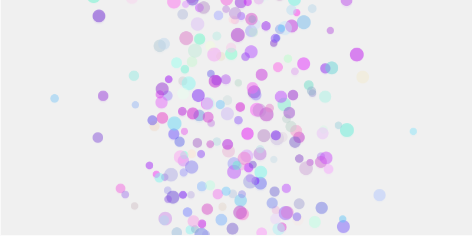

Simulación [aquí](https://editor.p5js.org/WatermelonSuggar/sketches/bfyxwGSWQ)



**Código de ejemplo**
```js

let burbujas = [];
let ancho, alto;

function setup() {
  createCanvas(800, 400);
  ancho = width;
  alto = height;
  noStroke();
  background(255);
}

function draw() {
  background(240, 220); // Fondo con transparencia para efecto de desvanecimiento

  // Generar un número aleatorio con distribución normal
  let num = randomGaussian();
  let desviacion = 100;
  let media = width / 2;
  let x = num * desviacion + media;

  // Crear una nueva burbuja
  let nuevaBurbuja= {
    x: x,
    y: height,
    radio: random(6, 12),
    velocidad: random(1, 3),
    color: color(random(100, 255), random(10, 255), random(200, 255), 120)
  };
  burbujas.push(nuevaBurbuja);

  // Actualizar y dibujar burbujas
  for (let i = burbujas.length - 1; i >= 0; i--) {
    let b = burbujas[i];
    fill(b.color);
    ellipse(b.x, b.y, b.radio * 2);

    // Movimiento hacia arriba
    b.y -= b.velocidad;

    // Desaparecer si salen del lienzo
    if (b.y + b.radio < 0) {
      burbujas.splice(i, 1);
    }
  }
}

```
**Reflejo de la distribución normal en la visualización**

* Las burbujas representan números aleatorios generados con una distribución normal (gaussiana). Su posición horizontal (x) refleja esta distribución: la mayoría de las burbujas se agrupan cerca del centro del lienzo, donde está la media, mientras que menos burbujas aparecen en los extremos, ya que los valores alejados de la media son menos frecuentes.
