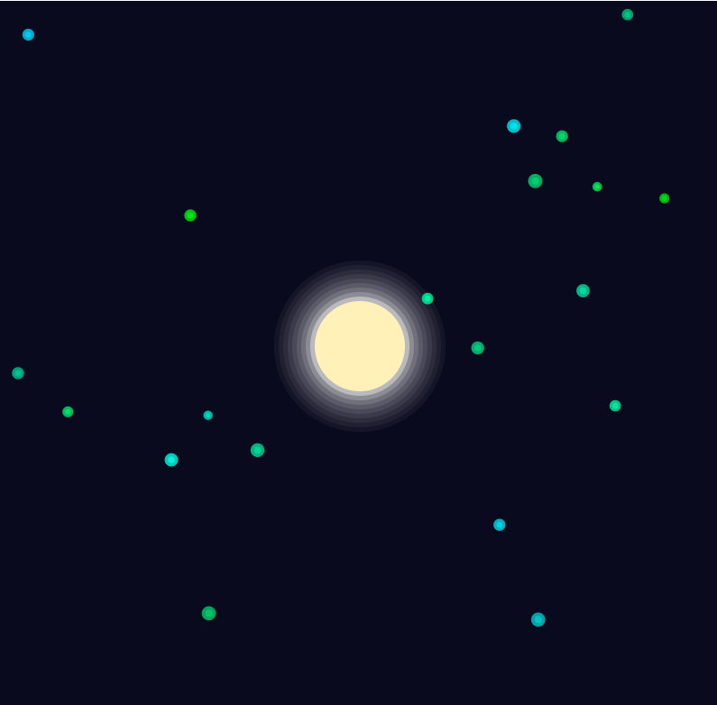

**Lévy flight**
 
El concepto de Levy Flight es una forma de movimiento aleatorio que combina pasos cortos frecuentes con pasos largos ocasionales. Este comportamiento es muy diferente del movimiento aleatorio 
clásico (como un paseo aleatorio o random walk) porque incluye "saltos largos" que ocurren de forma menos frecuente pero tienen un impacto significativo en el desplazamiento total.

🫧 **Casos interesantes para usarlo:**

* **Arte generativo**
  
  * **Patrones de Partículas Orgánicas:** Crear simulaciones de enjambres o nubes de partículas con trayectorias impredecibles.
    Ejemplo: Representar un enjambre de luciérnagas donde algunas se alejan del grupo de manera ocasional.

  * **Diseño de Paisajes Naturales:** Generar distribuciones de árboles, rocas o elementos naturales en un terreno.
    Ejemplo: En un bosque generado proceduralmente, los árboles podrían agruparse en ciertas áreas con dispersos puntos lejanos que simulan rarezas naturales.

  * **Pinturas Digitales Abstractas:** Utilizalo para determinar la posición de trazos de pintura o gotas en un lienzo virtual.
    Ejemplo: Crear obras que imiten el comportamiento de tinta dispersa en papel húmedo, con salpicaduras ocasionales más grandes.

* **Sistemas Interactivos**

  * **Comportamiento de Enemigos en Videojuegos:** Usalo para que enemigos en un videojuego tengan patrones de movimiento impredecibles, dificultando al jugador anticipar su trayectoria.
    Ejemplo: Un jefe final que combina ataques cercanos frecuentes con movimientos rápidos y lejanos para sorprender al jugador.
  
  * **Sistemas de Dibujo Colaborativo:** Implementar herramientas de dibujo digital donde las trayectorias de los pinceles tengan comportamientos orgánicos.
  Ejemplo: Una aplicación donde el usuario puede dibujar, pero las líneas ocasionalmente saltan a zonas inesperadas para fomentar la creatividad.

🌕 **SIMULACIÓN**

Enlace de la simulación [aquí](https://editor.p5js.org/WatermelonSuggar/sketches/AchtyHHaY)



**Código**
```js
let fireflies = [];
let moon;
let attractToMoon = false; // Control booleano

function setup() {
  createCanvas(800, 800);
  moon = new Moon(width / 2, height / 2, 50);
  for (let i = 0; i < 20; i++) {
    fireflies.push(new Firefly(random(width), random(height)));
  }
}

function draw() {
  background(10, 10, 30);
  moon.display();

  for (let firefly of fireflies) {
    firefly.update();
    firefly.display();
  }
}

// Cambiar el estado del booleano cuando el cursor esté sobre el Sol
function mouseMoved() {
  let d = dist(mouseX, mouseY, moon.x, moon.y);
  attractToMoon = d < moon.r; // Se activa si el cursor está dentro del radio del Sol
}

class Moon {
  constructor(x, y, r) {
    this.x = x;
    this.y = y;
    this.r = r;
  }

  display() {
    noStroke();
    fill(255, 204, 0);
    ellipse(this.x, this.y, this.r * 2);
    // Simulated glow effect
    for (let i = 1; i < 10; i++) {
      fill(255, 255, 255, 100 / i);
      ellipse(this.x, this.y, this.r * 2 + i * 10);
    }
  }
}

class Firefly {
  constructor(x, y) {
    this.pos = createVector(x, y);
    this.vel = createVector(0, 0);
    this.acc = createVector(0, 0);
    this.radius = random(5, 8); // Tamaño de la luciérnaga
    this.maxSpeed = random(2, 4); // Velocidad máxima
    this.color = color(0, random(200, 255), random(10, 250), 200); // Amarillo verdoso
  }

  update() {
    // Aplicar Levy Flight
    let angle = random(TWO_PI);
    let step = this.levyFlight();
    this.acc = p5.Vector.fromAngle(angle).mult(step);

    // Aplicar fuerza central solo si attractToMoon es verdadero
    if (attractToMoon) {
      let moonForce = p5.Vector.sub(createVector(moon.x, moon.y), this.pos);
      moonForce.setMag(0.02); // Magnitud de la atracción al Sol
      this.acc.add(moonForce);
    }

    // Actualizar velocidad y posición
    this.vel.add(this.acc);
    this.vel.limit(this.maxSpeed);
    this.pos.add(this.vel);

    // Envolver bordes (toroidal)
    if (this.pos.x > width) this.pos.x = 0;
    if (this.pos.x < 0) this.pos.x = width;
    if (this.pos.y > height) this.pos.y = 0;
    if (this.pos.y < 0) this.pos.y = height;
  }

  levyFlight() {
    let r = random();
    if (r < 0.2) {
      // Pasos largos (ocasionales)
      return random(20, 50);
    } else {
      // Pasos cortos (frecuentes)
      return random(1, 5);
    }
  }

  display() {
    noStroke();
    fill(this.color);
    ellipse(this.pos.x, this.pos.y, this.radius);

    // Efecto de brillo
    fill(this.color, random(100, 150));
    ellipse(this.pos.x, this.pos.y, this.radius * 2);
  }
}

```
Las "luciérnagas" se se sienten atraídas hacia la luna, así que si el cursor se ubica sobre esta habrá una fuerza externa que las atraiga a ella.
