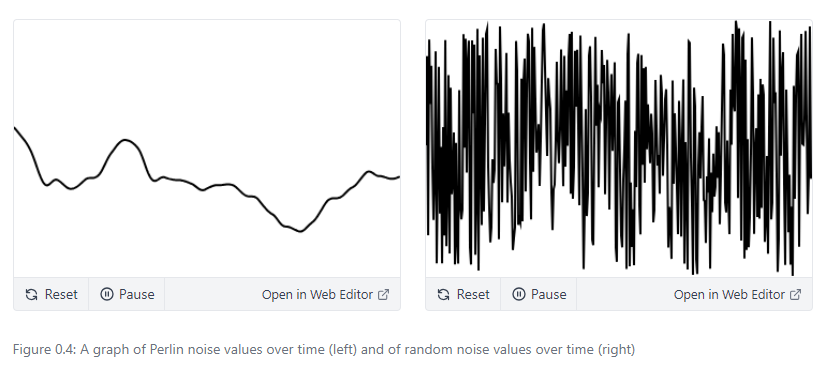

La imagen de la izquierda, que representa el ruido de Perlín, muestra un gráfico más agradable a la vista, con variaciones ligeras entre sus trazos que generan una sensación de coherencia, fluidez y suavidad, por otro lado,
la imagen de la derecha representa un gráfico generado con números aleatorios, que varían con mayor frecuencia creando esta sensación de acumulación de información en la que los datos varían drásticamente entre ellos.

🌻**Jardín interactivo**

Enlace a la simulación [aquí](https://editor.p5js.org/WatermelonSuggar/sketches/xH3sPdpxQ)

Empleé el ruido de Perlin para crear un jardín interactivo. Lo primero que se presenta es un canvas con algunos insectos revoloteando, la posición de cada insecto se calcula a partir de dos valores de ruido (uno para cada eje), noise(this.noiseX) y noise(this.noiseY) que generan valores entre 0 y 1 que son escalados al ancho y alto del lienzo, respectivamente. Esto produce un movimiento continuo y sin saltos, imitando el comportamiento errático pero fluido de un insecto real.

Al hacer click sobre el canvas se dibujan en él algunas flores, el ruido de Perlin ayuda en la generación de características visuales únicas para cada flor como el color de sus pétalos, el tamaño y hasta la cantidad de pétalos, características que no varían tanto debido a los pequeños saltos generados por el mismo ruido.


**Flores:** Cada flor tiene características únicas pero coherentes, simulando diversidad natural en colores y formas.

**Insectos:** Los insectos se mueven de manera fluida y aleatoria, replicando comportamientos biológicos observados en la naturaleza.


**Código**

```js

let flowers = []; // Lista de flores
let insects = []; // Lista de insectos
let noiseOffset = 0; // Offset del ruido de Perlin para generar flores únicas

function setup() {
  createCanvas(800, 600);
  background(0, 255, 236); // Color de césped
  // Crear insectos iniciales
  for (let i = 0; i < 15; i++) {
    insects.push(new Insect(random(width), random(height), random(0.1, 1)));
  }
}

function draw() {
  background(166, 255, 242, 50); // Suavizado para simular un brillo tenue

  // Dibujar flores
  for (let flower of flowers) {
    flower.grow();
    flower.display();
  }

  // Dibujar insectos
  for (let insect of insects) {
    insect.move();
    insect.display();
  }
}

function mousePressed() {
  // Crear una nueva flor en la posición del mouse
  flowers.push(new Flower(mouseX, mouseY, noiseOffset));
  noiseOffset += 0.5; // Incrementar el ruido más significativamente
}

class Flower {
  constructor(x, y, noiseOffset) {
    this.x = x;
    this.y = y;
    this.noiseOffset = noiseOffset;
    this.size = 0; // Tamaño inicial de la flor
    this.maxSize = random(20, 100); // Tamaño máximo basado en un rango aleatorio

    // Ajuste para variar la cantidad de pétalos de forma más visible
    this.petalCount = floor(map(noise(noiseOffset), 0, 1, 5, 15)); 

    this.petalColor = color(
      noise(noiseOffset) * 155,
      100 + noise(noiseOffset + 1) * 155,
      100 + noise(noiseOffset + 2) * 255
    ); // Color basado en el ruido
    this.centerColor = color(255, 204, 0); // Centro amarillo cálido
  }

  grow() {
    if (this.size < this.maxSize) {
      this.size += 0.5; // Crecimiento gradual
    }
  }

  display() {
    push();
    translate(this.x, this.y);
    for (let i = 0; i < this.petalCount; i++) {
      let angle = TWO_PI / this.petalCount * i;
      let petalX = cos(angle) * this.size;
      let petalY = sin(angle) * this.size;
      fill(this.petalColor);
      ellipse(petalX, petalY, this.size / 2, this.size); // Pétalos alargados
    }
    fill(this.centerColor);
    ellipse(0, 0, this.size / 2); // Centro de la flor
    pop();
  }
}

class Insect {
  constructor(x, y, speed) {
    this.x = x;
    this.y = y;
    this.speed = speed; // Velocidad de movimiento del insecto
    this.noiseX = random(1000); // Offset único para el movimiento en X
    this.noiseY = random(1000); // Offset único para el movimiento en Y
  }

  move() {
    this.x = noise(this.noiseX) * width; // Movimiento horizontal suave
    this.y = noise(this.noiseY) * height; // Movimiento vertical suave
    this.noiseX += 0.01 * this.speed; // Incrementar el ruido para simular movimiento
    this.noiseY += 0.01 * this.speed;
  }

  display() {
    fill(50, 50, 50); // Color del insecto
    ellipse(this.x, this.y, 10, 10); // Cuerpo del insecto
    fill(255);
    ellipse(this.x - 3, this.y - 3, 4, 4); // Ala izquierda
    ellipse(this.x + 3, this.y - 3, 4, 4); // Ala derecha
  }
}


```
