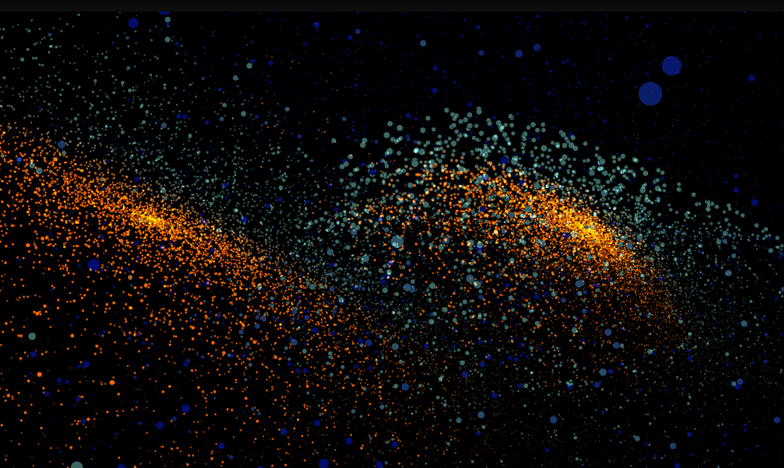

**Fiesta de partículas**

El proyecto será de exploración de partículas y cómo podemos crear formas divertidas con ellas. El usuario seleccionará desde su dispositivo algunas siluetas (preferiblemente de animales marinos) y las partículas rastrearán esta imagen y tratarán de imitarla por medio de su distribución en el canvas. Además, habrá un botón llamado "Fiesta🥳" que podrá crear un efecto divertido sobre el tamñano, colores y la distribución de las partículas; y un botón "Normal" para volver a la simulación.

**¿Cómo piensas usar los tres conceptos y por qué estos?**

* **Random Gaussean (distribución normal)** --> Colores de las partículas para que se mantengan dentro de una misma gama de color.
* **Random walk**--> Color del fondo para generar un efecto de viveza al canvas, lo pensé como un acuario que dependiendo de la luz que reciba del sol va a tener un azul más o menos profundo y el random walk hace que el cambio de color no sea abrupto.
* **Levy fligth**---> Activado mediante el botón fiesta, podría crear un ambiente divertido al cambiar los colores, el tamaño y el comportamiento de las partículas con los saltos cortos frecuentes y los largos ocasionales.

**Reporta los referentes que usaste para inspirarte.**

Patch de partículas en cables link [aquí](https://cables.gl/p/PSCYWt)

Cambio a modo "fiesta" inspirado en el trabajo de Emanuel :)
